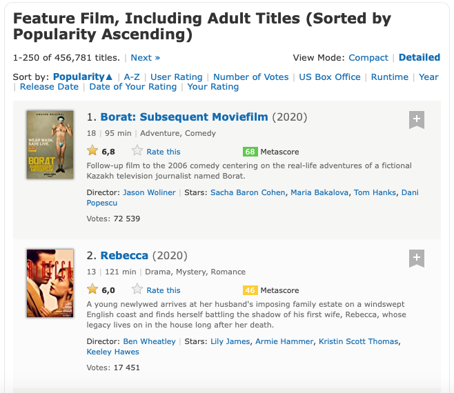

# Projet Python pour le Data Scientist

## Introduction

Ce dépôt GitHub regroupe des éléments de recherche gravitant autour de la problématique suivante :

### ***" Prédiction de la note d'un film à partir de ses principales caractéristiques "***

L'objectif est de construire un modèle de Machine Learning visant à prédire la note moyenne (spectateurs) qu'obtiendrait un film selon ses principales caractéristiques : genres principaux, durée, année de sortie, réalisateur, casting...

- *Sur quelles données les analyses ont-t-elles été menées ?*

Les recherches s'articulent autour de données de films présentés sur le site de l'IMDB (International Movie Database):

https://www.imdb.com

 Grâce au très large panel de données recensées sur ce site, nous avons collecté des informations sur près de 450 000 films. Plus précisément, nous avons retenu leur **titre**, **année de sortie**, **durée**, **réalisateur**, **acteurs** et **genres principaux**. De plus nous avons pu récolter la **note moyenne des spectateurs** attribuée à chaque film, ainsi que le **nombre de votes** qui ont permis de la constituer.

- *Comment les données ont-elles été récoltées ?*
 
 La base de données assujettie à nos analyses et prédictions fut construite via des procédés de web scraping et crawling à partir du site de l'IMDB.

 Une fois sur la page d'accueil, il est possible d'effectuer une recherche personnalisée de films, comme sur l'image qui suit : 

  

Notre seul critère fut d'inclure uniquement les films à proporement parler (catégorie "feature film" dans les options de recherche). Les séries et émissions tv ne sont donc pas comptés. Nous incluons également les films pour adultes ("adult titles"). Nous obtenons ainsi une liste de près de 450 000 films. Cette liste est fractionnée en plusieures pages (250 films par page soit N = 450 000/250 = 1800 pages environ). Voici la présentation "type" de l'une de ces pages :

  

Il est facilement observable que toutes les informations convoitées sont visibles sur la page. Il ne restait donc plus qu'à web scraper ces éléments, puis répéter la collecte sur toutes les pages qui constituent la liste (crawling).

Une fois les données collectées, elles furent nettoyées via l'application de procédés regex (expressions régulières) et manipulation classique de dataframes pandas.

Toutes les étapes de la constitution de la base sont disponibles sur le Notebook **scraping_cleaning.iynb**

- *Quels modèles pour la modélisation ?*

On peut s'aider de la carte des algorithmes de scikit learn :

  

